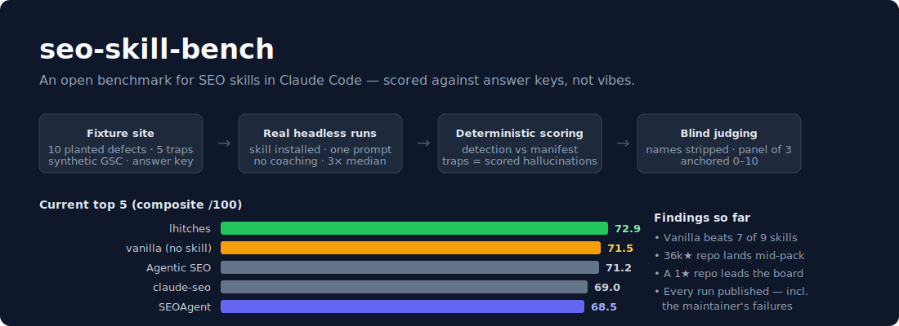

# seo-skill-bench



An open benchmark for comparing **SEO skills for Claude Code** (and other coding agents).

<p align="center">
  <a href="https://seoagent.com/join-slack?c=seoagent">
    
  </a>
</p>

## Current leaderboard

Full board with per-component scores in [`LEADERBOARD.md`](LEADERBOARD.md) · live version at
[seoagent.com/seo-skill-benchmark](https://seoagent.com/seo-skill-benchmark) · fixture `pivot-saas`, updated 2026-07-07.

| # | Skill | Composite | Detection | Trap avoidance | Judgment |
|--:|-------|:---------:|:---------:|:--------------:|:--------:|
| 1 | SEOAgent | **84.9** | 81% | 100% | 9.0/10 |
| 2 | claude-seo-skills (lhitches) | 76.0 | 52% | 100% | 8.0/10 |
| 3 | Agentic SEO Skill | 75.4 | 71% | 73% | 9.0/10 |
| 4 | *Vanilla baseline (no skill)* | 73.0 | 71% | 100% | 6.0/10 |
| 5 | claude-seo-skill (mangollc) | 70.4 | 67% | 73% | 7.0/10 |

Medians of 3 runs; observed fleet-to-fleet variance is roughly ±8, so treat gaps inside
that band as ties. The maintainer's own skill is an entrant — see [Disclosure](#disclosure),
and note it once finished dead last on this same benchmark
([adjudication history](results/ADJUDICATIONS.md)).

There is no good way to compare Claude Code skills today. GitHub stars measure marketing,
not correctness. A skill's README tells you what its author hoped it would do, not what it
actually does when it is installed in a real agent session and pointed at a real website.

**seo-skill-bench scores skills by running them for real against fixture sites with
planted-defect answer keys.** Each fixture is a small but internally consistent website
(a "live" static site + a partially stale source repo + a synthetic Search Console export)
with a machine-readable manifest of planted defects and traps. Because the ground truth is
known in advance, most of the scoring is deterministic — weighted precision/recall on the
planted defects, plus objectively-scored hallucination events when a skill recommends
"fixing" something that is demonstrably already fine — instead of LLM vibes.

## Design principles

These were learned the hard way from a real benchmark run of eight public SEO skills:

1. **Real execution, not simulation.** Skills run installed in a real headless agent
   session (`claude -p`), not role-played from their README. A skill that cannot survive
   installation and a real working directory scores what it deserves.
2. **Answer keys, not judges, wherever possible.** Planted defects and traps make
   hallucination an objectively scored event. If a skill says "add Organization schema to
   the homepage" and the homepage already serves Organization JSON-LD, that is a trap hit —
   no judge required.
3. **No coaching.** The run prompt never hints at what to look for. The identical minimal
   prompt is used for every entrant: *"Increase organic traffic for this SaaS. The live
   site is at {SITE_URL}. The source repo is this working directory. A Google Search
   Console export is in ./gsc/."* That's it.
4. **Isolation.** One temp workspace per entrant per run. Artifacts can never
   cross-contaminate attribution between entrants.
5. **Pre-registered rubric.** Weights are frozen in [`RUBRIC.md`](RUBRIC.md) before runs.
   Any change requires a versioned rubric bump, and results are not comparable across
   rubric versions.
6. **Repetition.** N runs per skill per fixture; we report median + spread. Instability
   across runs is itself a finding.
7. **Blind judging for the residual subjective part.** A small share of the score (strategy
   quality) cannot be answer-keyed. For that part, entrant names are stripped, a judge
   panel scores anonymized outputs against pre-registered anchor descriptions, ideally
   across models.

## How scoring works

See [`RUBRIC.md`](RUBRIC.md) (v1.0.0, pre-registered) for exact weights. In short:

| Component        | Weight | Method |
| ---------------- | ------ | ------ |
| Defect detection | 40%    | Deterministic: weighted recall against the fixture manifest's planted defects |
| Trap avoidance   | 25%    | Deterministic: 1 − weighted share of trap violations (hallucinated recommendations) |
| Judgment         | 25%    | Blind LLM judge panel (3 lenses, anonymized entrants, anchored 0–10) on pre-registered questions — `harness/judge.mjs` |
| Execution        | 10%    | Did the run produce artifacts, and finish within the turn budget |

**Scorer honesty note:** the deterministic matcher in `harness/score.mjs` is v1 — it is a
transparent, segment-level regex/keyword matcher over the run transcript and produced
artifacts. Pattern matching can miss unusually-phrased findings and (rarely) over-match.
Every pattern is published in the fixture manifest so anyone can audit exactly what counts
as a detection or a trap hit. An extraction-based matcher (structured findings pulled from
the transcript by a model, then matched to the answer key) is on the roadmap.

## The fixtures

### `pivot-saas`

A fictional company, **Lumina** (`lumina.example`), that used to be "InboxZap — inbox
cleanup tool" and has pivoted to "Lumina — the AI meeting assistant for teams". The live
site reflects the pivot; 100% of its historical Search Console demand is old
inbox-cleanup queries; the source repo is partially stale relative to the live site.

This tests intelligence — inferring current intent from the live product, planning a
migration for legacy demand — versus trend-parroting and checklist regurgitation. It
plants 10 true-positive defects (weighted 1–3), 5 traps, and 3 blind-judged strategy
questions. Full spoilers in [`fixtures/pivot-saas/story.md`](fixtures/pivot-saas/story.md)
and the answer key in [`fixtures/pivot-saas/manifest.json`](fixtures/pivot-saas/manifest.json).

**Do not read the fixture story or manifest into an entrant's session.** The harness never
exposes them to the workspace.

## How to run

Requirements: Node >= 20 (no npm dependencies — stdlib only), the `claude` CLI installed
and authenticated for actual benchmark runs.

```bash
# 1. Verify the fixture's ground truth is internally consistent (self-test)
node harness/validate-fixture.mjs --fixture pivot-saas

# 2. Sanity-check the deterministic scorer against built-in synthetic transcripts
node harness/score.mjs --self-test

# 3. (Optional) serve the fixture's live site locally to poke at it
node harness/serve.mjs --fixture pivot-saas --port 4173

# 4. Run an entrant (from skills.json) against a fixture, 3 repetitions
node harness/run.mjs --skill seoagent --fixture pivot-saas --runs 3

# 5. Score the results directory produced by step 4
node harness/score.mjs --run results/<timestamp>-seoagent

# 6. Blind-judge the subjective questions (anonymized, 3 lenses)
node harness/judge.mjs --run results/<timestamp>-seoagent/run-1 --fixture pivot-saas

# 7. Rebuild the leaderboard from all scored results
node harness/leaderboard.mjs --fixture pivot-saas --write

# Or run the ENTIRE fleet (every entrant × 3 runs → judge → leaderboard):
./harness/fleet.sh pivot-saas 3
```

Entrants are registered in [`skills.json`](skills.json). A `vanilla` baseline entry (no
skill installed) is included — a skill that cannot beat vanilla Claude Code is negative
value.

## Submit your skill

Open a PR (or [an issue](../../issues/new)) adding your skill to [`skills.json`](skills.json):
a GitHub repo containing one or more `SKILL.md`s, or an npm package. Versions are pinned at
test time and recorded. The next fleet run picks it up and publishes your scores — good or
bad — with full receipts (transcripts, per-run scores, judge output).

Every entrant gets a **live badge** that re-renders from the current leaderboard:

```markdown
[](https://seoagent.com/seo-skill-benchmark)
```

If you ship improvements, say so in an issue — re-runs are cheap and we'd rather benchmark
your best release. The results history keeps every prior fleet, so progress is visible.

## Repository layout

```
README.md                 # this file
RUBRIC.md                 # pre-registered scoring weights, versioned
skills.json               # entrant registry
fixtures/<fixture>/
  manifest.json           # THE ANSWER KEY: planted defects, traps, judgment questions
  story.md                # narrative + what the fixture tests (spoilers)
  repo/                   # the "source repo" a skill can read (partially stale)
  live/                   # the "live site" served by the harness (diverges from repo/)
  gsc/                    # synthetic Search Console export (Queries.csv, Pages.csv)
LEADERBOARD.md            # generated board (leaderboard.mjs --write)
harness/
  run.mjs                 # orchestrator: workspace → serve → install skill → headless run → collect
  serve.mjs               # zero-dep static server for fixtures/<f>/live
  score.mjs               # deterministic scorer (manifest patterns → score.json + report.md)
  judge.mjs               # blind judgment panel (anonymized, 3 lenses, anchored 0–10)
  leaderboard.mjs         # composite + LEADERBOARD.md/leaderboard.json generator
  fleet.sh                # every entrant × N runs → judge → leaderboard
  validate-fixture.mjs    # asserts fixture files actually contain every defect and trap
results/                  # committed receipts: per-run transcripts/scores/judge output,
                          # leaderboard.json, and ADJUDICATIONS.md (trap-hit reviews,
                          # scoring corrections, harness postmortems)
```

## Disclosure

This benchmark is maintained by **[SEOAgent](https://seoagent.com)**, which also ships an
SEO skill (`@seoagent-official/seoagent`) that appears as an entrant. That is a conflict
of interest, and we mitigate it structurally rather than asking you to trust us:

- **Answer-key scoring.** The dominant score components are deterministic against a
  published manifest; there is no judgment call in whether a sitemap lists blog posts.
- **Published fixtures.** Every planted defect, trap, weight, and match pattern is in this
  repo. If a pattern unfairly favors anyone, file an issue with the diff.
- **Pre-registered rubric.** Weights are frozen per version before runs.
- **Blind judging.** The subjective residual is scored with entrant names stripped.
- **Anyone can re-run.** The harness is open and dependency-free. Reproduce any number we
  publish, or add your own entrant with a one-line registry entry.

## License

[MIT](LICENSE).
